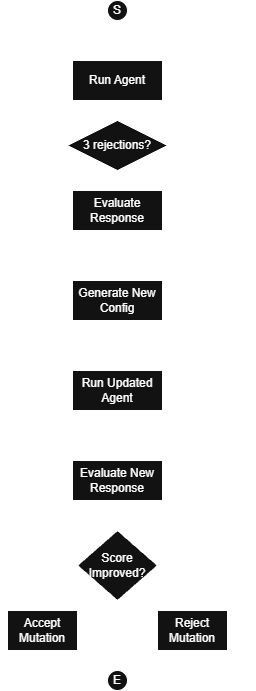

# Stem Agent

A prototype exploring how an AI agent can **specialize and improve itself** through a controlled evolution loop.

---

## How to Run

# 1. Clone repo
   - git clone https://github.com/fstefan3108/stem-agent.git
   - cd stem-agent

# 2. Install dependencies
   - pip install -r requirements.txt    

# 3. Run evolution
   - python main.py

---

## Project Idea

A stem cell doesn’t know what it will become. It receives signals and differentiates.

This project asks:

> Can an AI agent do the same?

Instead of manually designing a task-specific agent, we start with a **minimal agent** and let it evolve into a specialized one through:

- execution
- evaluation
- controlled mutation
- selection

---

## Project Goal

This project does **not aim to build the best agent**.

It aims to answer:

- When does self-improvement work?
- When does it fail?
- What limits the evolution process?

---

## Core Concept

The central artifact is:

AgentConfig = The "Genome" of the Stem Agent.

It defines how the agent behaves.

The system:
1. Runs the agent
2. Evaluates the output
3. Mutates one part of the config
4. Accepts/Rejects the mutation 

This creates a **controlled evolution loop**.

---

## System's Evolution Loop Diagram

## Core System Components

# Agent
- Generates responses using current AgentConfig.

# Evaluator
- Scores responses based on:
  - Coverage
  - Grounding
  - Insight

# Mutator

Rewrites exactly one field of the configuration per iteration.

# Evolution Loop

- Controls:
  - execution
  - mutation
  - selection (accept/reject)

## Experiments

- Located in:
  - /outputs/experiments/
  - /outputs/logs/
  - /outputs/analysis.md
  - Experiment 1 — Clear Task
  - No evolution (score ceiling reached)
  - Experiment 2 — Ambiguous Task
  - Improved structure, wrong domain
  - Experiment 3 — Simple Task
  - Over-optimization (worse answer, higher score)

## Key Findings
- The system optimizes what is measured
- It does not correct wrong interpretations
- It can produce overly complex answers
- Evolution converges quickly, not gradually
- Score != real usefulness

## Limitations
- No domain correctness check
- No task complexity awareness
- No exploration (low mutation diversity)
- Score ceiling (~4.0 without tools)

## Future Work
- Ask-first mechanism (clarify ambiguous queries)
- Web search integration
- Simplicity control (prevent over-optimization)
- Multi-task evaluation

## Development Approach
- Each feature was built using:
  - Analyze before coding
  - Build minimal working version
  - Handle edge cases
  - Test behavior
  - Optimize only if needed